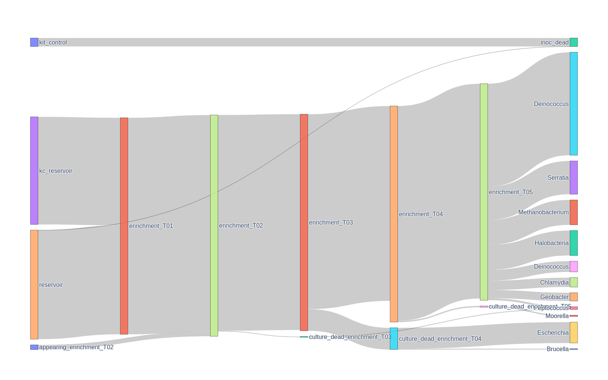

# Sankey diagram for microbial enrichment culture

Python package to make Sankey diagram for Microbial Enrichment cultures.



## Installation

This package requires:
- plotly and kaleido (with google chrome installed).
- pandas and numpy.

It can be isntalled with pip:
```
pip install sankeymien
```


It can be installed by cloning this repository and with pip:
```
git clone https://github.com/ArnaudBelcour/sankeymien.git

cd sankeymien

pip install -e .
```

## Usage

It can be used as a command line:

```
sankeymien -a abundance_table.tsv -j experiments.json -o testoutput -t taxon
```

`-a abundance_table.tsv` is a tabulated file containing as a first column organism ID, several columns corresponding to samples anda column containing taxon name (and given with `-t taxon`).

`-j experiments.json` is a json file indicating the experiments and the association between time steps and samples.

`-o testoutput` is the output folder.

## Input

The abundance sample should look like this:

| organism | s1   | s2   | k1 | Ec1_1 | Ec1_2 | Ec1_3 | kec1 | taxon            |
|----------|------|------|----|-------|-------|-------|------|------------------|
| org_a    | 1    | 2    | 5  | 0     | 0     | 0     | 0    | Bos              |
| org_b    | 2000 | 3000 | 10 | 100   | 120   | 130   | 1    | Escherichia      |
| org_c    | 500  | 600  | 5  | 100   | 200   | 300   | 0    | Parcubacteria    |
| org_d    | 20   | 30   | 0  | 25    | 35    | 40    | 0    | Methanobacterium |

The json should correspond to this:

```json
{
    "experiment_2": {
        "initial": ["s1", "s2"],
        "kit_control": ["k1"],
        "enrichment_T01": ["Ec1_1", "Ec1_2", "Ec1_3"],
        "kit_control_T01": ["kec1"]
    }
}
```

## Output

It generates a Sankey diagram showing the flow of relative abundance of organisms according to the different time steps of the enrichment cultures. The final enrichment is linked to taxon name to show the composition of the final communities.
